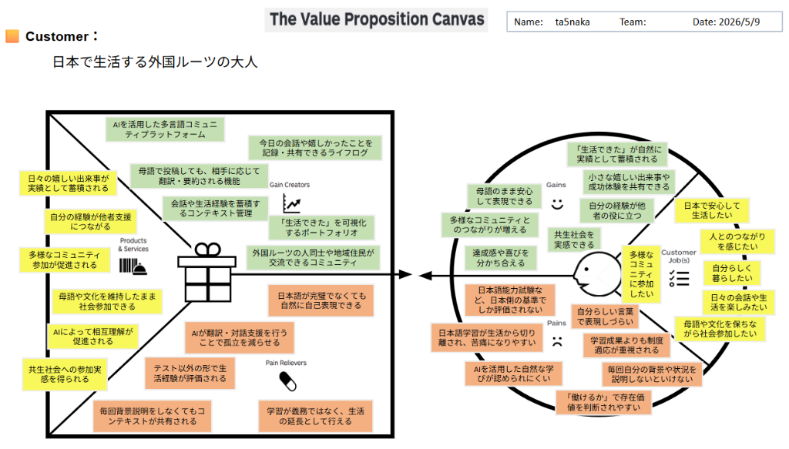

# Value Proposition Canvas (V1)

**顧客像：日本で生活する外国ルーツの大人**

## 1. Customer Profile (右側)

### Customer Job(s)
- 日本で安心して生活したい
- 人とのつながりを感じたい
- 自分らしく暮らしたい
- 日々の会話や生活を楽しみたい
- 母語や文化を保ちながら社会参加したい
- 多様なコミュニティに参加したい

### Pains
- 日本語能力試験など、日本側の基準でしか評価されない
- 自分らしい言葉で表現しづらい
- 日本語学習が生活から切り離され、苦痛になりやすい
- 学習成果よりも制度適応が重視される
- AIを活用した自然な学びが認められにくい
- 毎回自分の背景や状況を説明しないといけない
- 「働けるか」で存在価値を判断されやすい

### Gains
- 「生活できた」が自然に実績として蓄積される
- 小さな嬉しい出来事や成功体験を共有できる
- 自分の経験が他者の役に立つ
- 母語のまま安心して表現できる
- 多様なコミュニティとのつながりが増える
- 共生社会を実感できる
- 達成感や喜びを分かち合える

---

## 2. Value Map (左側)

### Products & Services
- AIを活用した多言語コミュニティプラットフォーム
- 日々の嬉しい出来事が実績として蓄積される
- 自分の経験が他者支援につながる
- 多様なコミュニティ参加が促進される
- 母語や文化を維持したまま社会参加できる
- AIによって相互理解が促進される
- 共生社会への参加実感が得られる

### Pain Relievers
- AIが翻訳・対話支援を行うことで孤立を減らせる
- テスト以外の形で生活経験が評価される
- 毎回背景説明をしなくてもコンテキストが共有される
- 学習が義務ではなく、生活の延長として行える
- 日本語が完璧でなくても自然に自己表現できる

### Gain Creators
- 今日の会話や嬉しかったことを記録・共有できるライフログ
- 母語で投稿しても、相手に応じて翻訳・要約される機能
- 会話や生活経験を蓄積するコンテキスト管理
- 「生活できた」を可視化するポートフォリオ
- 外国ルーツの人同士や地域住民が交流できるコミュニティ
